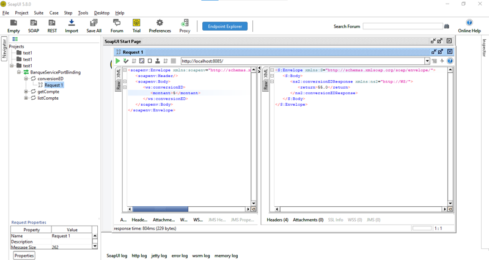
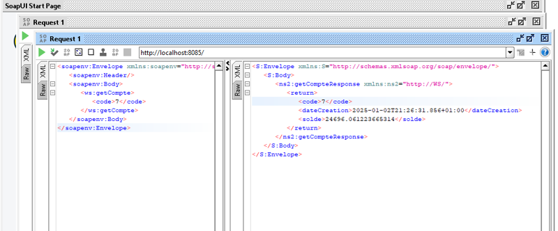
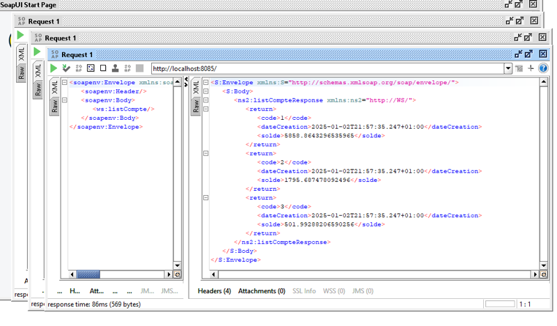

# SOAP Web Service Test – Banque Project 🏦

This project demonstrates SOAP web services tested using SoapUI. The service includes the following operations:

- Currency conversion (MAD to EURO)
- Get single account by code
- List all bank accounts

## 🧪 Test Screenshots

### ✅ 1. Conversion MAD to EURO


### ✅ 2. Get Account by Code


### ✅ 3. List All Accounts


## 🛠️ Technologies Used
- Java / Spring Boot
- SOAP Web Services (JAX-WS)
- SoapUI for testing
- Maven for dependency management

## 📂 Project Structure
```
📦banque-soap-service
 ┣ 📁src
 ┣ 📄README.md
 ┣ 📁images
    ┣ 📄soapui_1.png
    ┣ 📄soapui_2.png
    ┗ 📄soapui_3.png
```

## 🚀 How to Run
1. Start the Spring Boot application.
2. Open SoapUI and import the WSDL file.
3. Send requests to `http://localhost:8085/ws`.

---

📧 For any questions, feel free to reach out.
